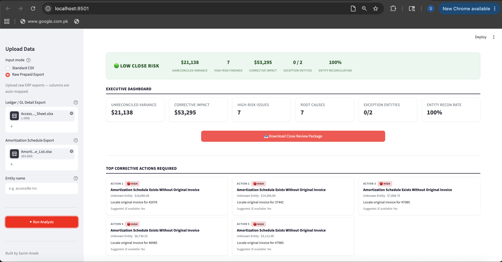
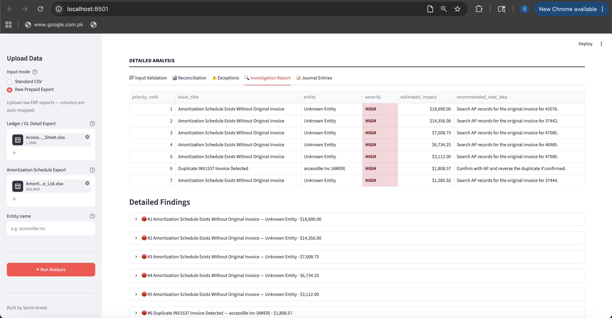
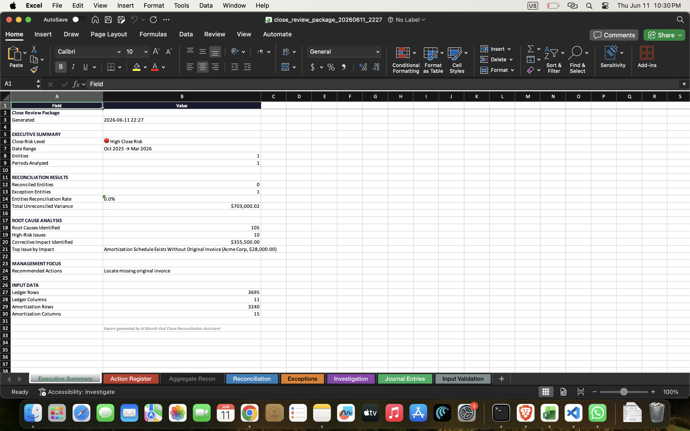

# AI Month-End Close Assistant

A prepaid expense reconciliation system that validates ERP exports, reconciles balances, detects accounting exceptions, and produces management-ready close review packages.

Built as a working demonstration of how structured accounting logic, data normalization, and automated exception detection can reduce the manual effort involved in month-end close.



---

## Highlights

- **ERP Data Adapter** -- normalizes raw exports from NetSuite, QuickBooks, SAP, Oracle, and Xero into a standard reconciliation schema
- **Aggregate Reconciliation** -- balance-first methodology comparing expected prepaid balance against GL balance per entity, with dynamic materiality thresholds
- **Six Exception Detection Rules** -- duplicate bills, missing source invoices, missing amortization entries, over-amortization, under-amortization, manual adjustments
- **Root Cause Analysis** -- each finding includes severity, confidence level, financial impact, evidence references, and a corrective journal entry
- **Executive Dashboard** -- Streamlit interface with aggregate reconciliation status, prioritized corrective actions, and period-level drill-down
- **Excel Close Package** -- management-ready workbook with executive summary, action register, investigation report, and suggested journal entries
- **11 Synthetic Test Cases** -- controlled validation scenarios covering all exception types with predetermined expected results
- **Real-World Benchmark Validation** -- tested against a production NetSuite dataset; final output matches an independent manual review exactly

---

## The Problem

Month-end close teams spend significant time on repetitive reconciliation work: comparing GL balances against amortization schedules, investigating variances, identifying duplicate postings, and documenting findings for management review. For prepaid expenses alone, this process can involve hundreds of transactions across multiple entities and dozens of accounting periods.

Most of this work follows a repeatable pattern: validate the data, compare expected against actual, flag the exceptions, and document the results. This project automates that pattern.

---

## Features

### Data Adapter

Accepts raw exports from ERP systems (NetSuite, QuickBooks, SAP, Oracle, Xero) and normalizes them into a standard reconciliation schema. Handles varying column names, date formats, header rows, and transaction type conventions. Provides full mapping transparency so the user can verify how source fields were interpreted.

### Aggregate Reconciliation

Uses a balance-first methodology: compares the expected remaining prepaid balance (derived from amortization schedules) against the actual GL balance per entity. This approach produces a reliable top-level reconciliation result before drilling into period-level detail. Materiality thresholds are calculated dynamically as a percentage of total dataset volume.

### Exception Detection

Six rule-based detection modules identify specific accounting issues:

- **Duplicate Bills** -- same document, amount, period, and prepaid item posted more than once
- **Missing Source Invoices** -- amortization schedules referencing Bills that do not appear in the general ledger
- **Missing Amortization Entries** -- scheduled amortization that was not posted as a journal entry
- **Over-Amortization** -- actual amortization exceeding the scheduled amount
- **Under-Amortization** -- actual amortization falling short of the scheduled amount
- **Manual Adjustments** -- journal entries containing reclassification, correction, or write-off indicators

Each finding includes severity, confidence level, estimated financial impact, evidence references, and a suggested corrective journal entry.

### Executive Dashboard

A Streamlit interface presenting reconciliation status, root cause analytics, prioritized corrective actions, and drill-down detail tabs. The dashboard is designed for a 30-second executive review: aggregate reconciliation status and top findings are visible immediately, with period-level detail available in supporting tabs.

### Close Review Package

A downloadable Excel workbook containing an executive summary, aggregate reconciliation, corrective action register, investigation report, suggested journal entries, and input validation detail. Formatted with frozen panes, tab colors, and dollar formatting for direct use in close review meetings.

---

## Architecture

```
Raw ERP Export (CSV / Excel)
         |
         v
  Data Adapter Layer
  Column mapping, date normalization, entity enrichment
         |
         v
  Validation Layer
  Schema checks, required fields, data quality warnings
         |
         v
  Reconciliation Engine
  Aggregate balance reconciliation + period-level drill-down
         |
         v
  Exception Detection
  Six rule-based detection modules with confidence scoring
         |
         v
  Root Cause Analysis
  Severity, impact quantification, corrective actions
         |
         v
  Executive Dashboard          Excel Close Package
  Streamlit + Plotly           Formatted multi-sheet workbook
```

### File Structure

| File | Purpose |
|---|---|
| `reconciliation_engine.py` | Core reconciliation and exception detection logic |
| `prepaid_data_adapter.py` | ERP export normalization and validation |
| `app.py` | Streamlit dashboard and Excel export |
| `requirements.txt` | Python dependencies |
| `test_cases/` | 11 synthetic validation scenarios |

---

## Validation and Benchmarking

The engine was tested against a production NetSuite dataset: two legal entities, 1,357 amortization schedules ($17M), 8,956 ledger transactions, 65 accounting periods. An independent manual review established the ground truth before any automated output was examined.

**Initial result:** 1,142 findings, $15M corrective impact flagged. The independent review identified 7 verified issues totaling $53K -- a 163:1 false positive ratio.

**Root causes identified:**

| False Positive Source | Count |
|---|---|
| Future amortization periods flagged as missing JEs | ~500 |
| Journal/Bill-Credit schedules misidentified as missing invoices | ~277 |
| Recurring invoices misclassified as duplicates | 61 |
| Period-level variance from missing entity on schedule | ~164 exceptions |

**Engineering improvements:**

- Source document parsing added: Journal and Bill Credit schedules excluded from missing-invoice detection
- Future period filter: schedule periods after the ledger's last posting date excluded from amortization checks
- Schedule status filter: Completed and Not Started schedules excluded from exception detection
- Strict duplicate criteria: same document, amount, period, and prepaid item required; multi-line invoices excluded
- Aggregate reconciliation: methodology changed from 169 period comparisons to 2 entity-level balance comparisons

**Final result:** 7 actionable findings, $53K corrective impact -- matching the independent review exactly. Both entities reconcile within tolerance. False positive rate: 0.

---

## Testing Approach

The engine is validated against 11 controlled synthetic test cases. Each test case contains a ledger, an amortization schedule, and a documented expected result. The data is not randomized -- every transaction and exception is placed deliberately so the expected finding count and financial impact can be predicted before the engine runs.

| Test Case | Purpose | Expected Findings |
|---|---|---|
| Clean Company | Confirm zero false positives | 0 |
| Duplicate Bills | Detect same-document same-amount postings | 5 |
| Missing Amortization | Detect unposted scheduled entries | 4 |
| Over-Amortization | Detect excess expense recognition | 3 |
| Under-Amortization | Detect incomplete amortization | 3 |
| Manual Adjustments | Detect out-of-process journal entries | 3 |
| Unlinked Schedules | Detect orphaned prepaid additions | 3 |
| Missing Source Invoice | Detect schedules without originating Bills | 3 |
| Multi-Entity | Validate entity-level isolation | 4 |
| Materiality Thresholds | Test small vs large exception handling | 6 |
| Stress Test | Performance across 3,700 rows with all rule types | 155 |

Synthetic testing was chosen because reconciliation logic requires deterministic validation -- the test must know the exact correct answer before the engine runs. Real-world ERP data was then used as a secondary benchmark to validate that the engine performs correctly on messy, production-scale data.

---

## Screenshots





---

## Running Locally

```bash
git clone https://github.com/yourusername/month-end-close-assistant.git
cd month-end-close-assistant

pip install -r requirements.txt

streamlit run app.py
```

Upload a prepaid ledger and amortization schedule using the sidebar. Sample test files are included in the `test_cases/` directory.

---

## Technical Stack

| Component | Technology |
|---|---|
| Reconciliation Engine | Python, Pandas |
| Data Adapter | Python, Pandas, openpyxl |
| Dashboard | Streamlit, Plotly |
| Excel Export | openpyxl |

---

## Future Roadmap

The prepaid expense module is the first component of a planned month-end close platform. Future modules under consideration:

- **Accrual Reconciliation** -- matching accrued expenses against vendor invoices and payment records
- **Fixed Asset Reconciliation** -- reconciling asset subledgers against depreciation schedules
- **Deferred Revenue Reconciliation** -- reconciling deferred revenue balances against revenue recognition schedules

The architecture is designed so that additional reconciliation modules can reuse the same data adapter, dashboard framework, and Excel export infrastructure.

---

## Key Outcomes

Reduced engine findings from 1,142 to 7 on a production NetSuite dataset, achieving exact alignment with an independent manual accounting review

Designed and implemented a balance-first aggregate reconciliation methodology, replacing a period-level approach that generated 164 false exception periods across 2 entities

Built a reusable ERP normalization layer that maps raw exports from NetSuite, QuickBooks, SAP, Oracle, and Xero into a standard schema with full column mapping transparency

Implemented six rule-based exception detection modules with source document parsing, schedule status filtering, and materiality-aware confidence scoring to distinguish genuine accounting issues from data artifacts

Validated the engine against 11 controlled synthetic test cases covering all exception types, plus a real-world benchmark that confirmed zero false positives on clean data

Produced a management-ready Excel close review package and Streamlit dashboard used to present aggregate reconciliation status, prioritized corrective actions, and suggested journal entries

---

## Author

**Sarim Areeb**

MS Business Analytics, Purdue University. PwC and EY Advisory.
